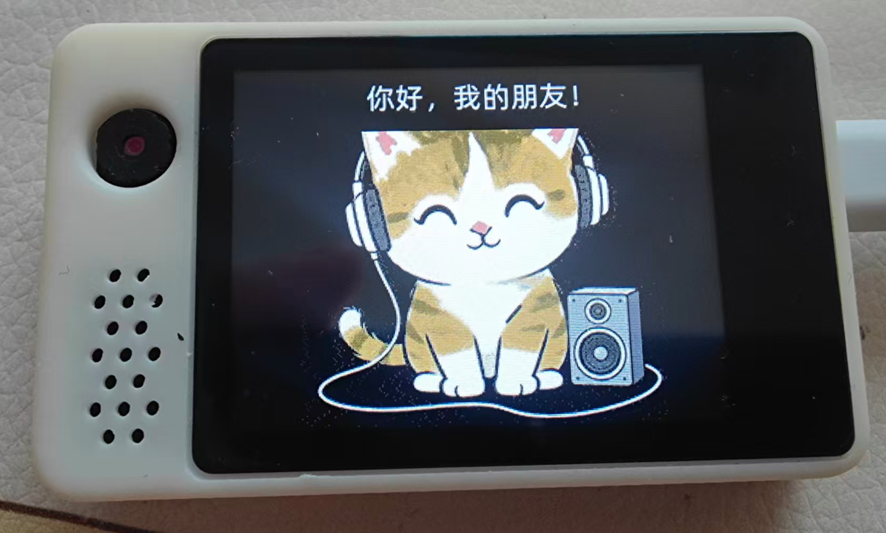
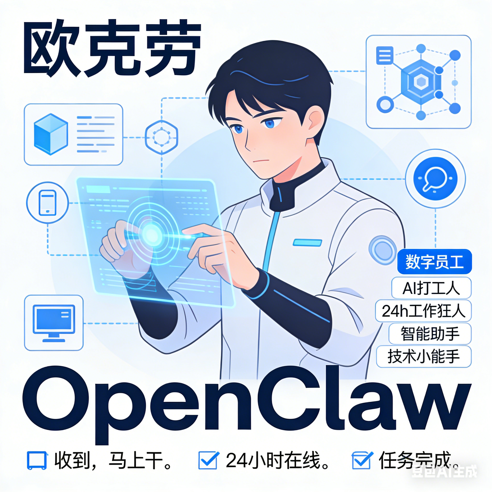
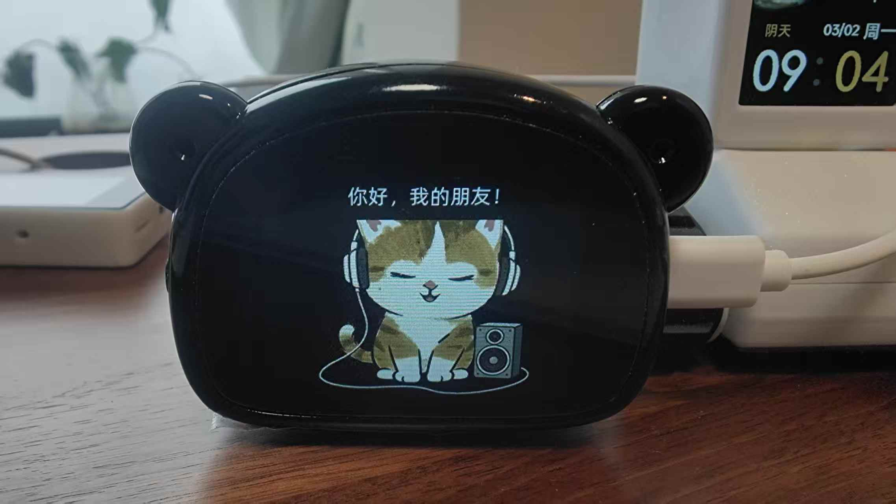

# XiaoZhi-OpenClaw
将小智跟OpenClaw集成，这样小智就能跟OpenClaw连接一起





# OpenClaw（欧克劳） + 小智 集成概述

本文档描述了 **小智 (XiaoZhi)** 机器人与 **OpenClaw (OKLao/OuKeLao)** 数字员工系统的集成方案。

## 1. 架构概述

该集成实现了以下交互流程：

1.  **用户** 通过语音向小智发送指令。
2.  **小智** 使用 LLM 解析意图。
3.  **小智** 调用工具 `self.OKLao.sendmessage` 将指令转发给 OpenClaw。
4.  **MoltbotClient** 通过 MQTT (Over WebSocket) 将消息发送给 OpenClaw 网关。
5.  **OpenClaw** 处理指令并返回结果（文本或语音）。
6.  **MoltbotClient** 接收结果，生成 TTS 语音或直接播放，并通过小智的扬声器播报。

## 2. 核心组件

### 2.1 McpServer (`main/mcp_server.cc`)

在 `McpServer::AddCommonTools` 中注册了专用工具 `self.OKLao.sendmessage`。

-   **工具名称**: `self.OKLao.sendmessage`
-   **描述**: Send a message to OKLao, 对应拼音OuKeLao...
-   **参数**: `message` (string)
-   **功能**:
    -   接收用户的自然语言指令。
    -   **Prompt 工程优化**: 在指令后附加 `(Execute immediately. If success, reply '老板，已搞定！'...)`，强制要求 OpenClaw 给出明确、简短的反馈，避免“正在处理”等无效回复。
    -   调用 `MoltbotClient::SendUserMessage` 发送消息。

### 2.2 MoltbotClient (`main/app/app_moltbot.cc` / `.h`)

负责与 OpenClaw 后端的 WebSocket 通信。

-   **连接管理**: 维护 WebSocket 连接，处理心跳和自动重连。
-   **协议**: 使用自定义的 JSON 消息格式。
-   **关键方法**:
    -   `SendUserMessage(string)`: 构造 `node.event` 类型的 JSON 消息发送给 OpenClaw。
    -   `OnDataReceived`: 处理下行消息。
        -   解析 JSON，识别 `voice.transcript` (TTS文本) 或其他指令。
        -   **TTS 缓冲处理**: 针对长文本回复（如 `voice.transcript`），使用 `TTS Buffer` 机制，将 OpenClaw 返回的文字分段合成为语音并播放，防止长文本导致的内存溢出或卡顿。
    -   `SendHandshake`: 连接建立后的身份认证。

### 2.3 关键优化点 (2026-02-02 更新)

1.  **Prompt 强化**:
    -   在 `mcp_server.cc` 中，强制要求 OpenClaw 返回 "老板，已搞定！" 或 "老板，这事办不了。"。
    -   目的：减少语音交互的延迟感，提供类似“对讲机”收到确认的爽快感。

2.  **JSON 解析修复**:
    -   重构了 `app_moltbot.cc` 中的 `cJSON` 解析逻辑，将其封装在 `MoltbotClient::OnDataReceived` 内部，避免了原有代码中可能导致崩溃的各种裸指针访问。

3.  **TTS 稳定性**:
    -   修复了接收到长回复时系统 Crash 的问题，确保 TTS 任务稳定运行。

## 3. 后续维护指南

### 修改 Prompt

若需调整小智给 OpenClaw 的指令格式（例如改变语气或要求），请修改 `main/mcp_server.cc` 中的 `std::string prompt = ...` 行。

### 修改通信协议

若 OpenClaw 后端协议变更（如更换 Topic 或 JSON 字段），请修改 `main/app/app_moltbot.cc` 中的 `SendUserMessage` (发送逻辑) 和 `OnDataReceived` (接收逻辑)。

### 修改设备标识

当前设备 ID 基于 MAC 地址生成 (`esp32_xxxxxx`)。若需变更认证逻辑，请修改 `MoltbotClient::get_device_id`。

---

*文档生成日期: 2026年2月2日*

## 4. 通信协议细节与踩坑记录

本节整理了对接过程中的关键协议细节和处理过的“坑”，供排查问题参考。

### 4.1 通信协议 (Node Protocol)

OpenClaw 使用 WebSocket 进行全双工通信，协议格式基于 JSON-RPC 的变体。小智在其中扮演一个 **Client Node** 的角色。

#### 4.1.1 握手 (Handshake)

连接建立后，Client 会收到 `connect.challenge` 事件，需立即回复 `connect` 请求以完成认证。

*   ** Challenge 消息**: Server 发送 `{"event": "connect.challenge", "payload": {"nonce": "..."}}`
*   ** Connect 响应**: Client 回复 `{"type": "req", "method": "connect", "params": {...}}`
    *   **params.role**: 必须设为 `"node"`。
    *   **params.client**: 包含设备信息。代码中目前硬编码为 `id: "node-host"`, `platform: "esp32"`, `mode: "node"`。
    *   **params.caps**: 声明能力，如 `["audio_input", "audio_output"]`。
    *   **params.auth.token**: 用于鉴权的 token (默认 `xiaozhi2026`)。

> **注意**: 握手成功后，Server 才会下发后续的 `agent` 或 `message` 事件。

#### 4.1.2 发送指令 (SendUserMessage)

小智将用户的自然语言指令发送给 OpenClaw 的 `voice.transcript` 节点。这相当于模拟用户对 OpenClaw 说了话。

* **Method**: `node.event`

* **Event**: `voice.transcript`

* **Packet Structure**:

  ```json
  {
    "type": "req",
    "id": "req-<random>",
    "method": "node.event",
    "params": {
      "event": "voice.transcript",
      "payloadJSON": "{\"text\":\"<Escaped Prompt>\",\"sessionKey\":\"main\"}"
    }
  }
  ```

* **关键点**: `payloadJSON` 是一个 **Stringified JSON**，即内部的 `payload` 需要再次进行 JSON 字符串转义。小智端代码手动处理了这层嵌套转义。

#### 4.1.3 接收回复 (OnDataReceived)

OpenClaw 的回复主要通过 `agent` 事件下发，包含流式文本 (Delta)。

*   **Event**: `agent`
*   **Payload**:
    *   `data.delta`: 新增的文本片段（流式）。
    *   `data.phase`: 生命周期状态，如 `"end"` 表示回复结束。

### 4.2 踩坑记录 (Pitfalls & Fixes)

#### 1. JSON 解析崩溃 (Buffer Overflow / Null Ptr)

*   **现象**: 接收到 OpenClaw 消息时，设备随机重启 (Guru Meditation Error)。
*   **原因**: 原有代码直接操作 `cJSON` 对象指针对 `root` 或 `payload` 进行访问，未做充分的判空校验；且部分 JSON 字段可能不存在。
*   **解决**: 重写 `OnDataReceived`，对所有 `cJSON_GetObjectItem` 返回值增加 `if (item && cJSON_IsString(item))` 等严格校验。

#### 2. TTS 内存溢出 (TTS Buffer)

*   **现象**: OpenClaw 回复长文本（如 50 字以上）时，系统崩溃。
*   **原因**: 小智的 TTS 引擎或内存无法一次性处理过长的文本字符串；或者短时间内频繁调用 TTS 接口导致任务队列堆积耗尽堆内存。
*   **解决**: 引入 **TTS Buffer (缓冲)** 机制。
    *   接收 `delta` 文本时不立即播放，而是存入 `std::string message_buffer_`。
    *   检测到 **标点符号** (。？！. ? ! \n) 或 buffer 积累一定长度后，才触发一次 TTS 播放并清空 buffer。
    *   收到 `phase: "end"` 信号时，强制刷新剩余 buffer。

#### 3. 嵌套 JSON 转义错误

*   **现象**: OpenClaw 后端报错 "Invalid JSON" 或无法识别指令。
*   **原因**: `node.event` 协议要求 `payloadJSON` 字段必须是 **序列化后的字符串**，而不是 JSON 对象。
*   **解决**: 在 C++ 代码中手动进行两层转义：先构建内部 JSON 串，再将其中的 `"` 和 `\` 转义后放入外层 JSON。

#### 4. Prompt 啰嗦问题

*   **现象**: OpenClaw 回复 "正在为您处理..." 或 "好的，我明白了"，导致语音交互拖沓。
*   **解决**: 在 `mcp_server.cc` 中对 Prompt 进行 Prompt Engineering，强制附加指令：`(Execute immediately... If success, reply '老板，已搞定！'...)`，屏蔽过程性回复。

#### 5. 握手时序

*   **现象**: 偶尔连接后无法发送消息。
*   **原因**: 未处理 `connect.challenge` 就尝试发送数据。
*   **解决**: 严格遵循协议状态机，必须先等待收到 server 的 challenge 并回复 connect 成功后，才标记 `is_handshake_done_` 允许业务通信。




## 关于瞄小智固件

见 miaoxiaozhi 目录

没有对应硬件板子的，需要定制的进QQ群提需求。


## 瞄小智交流QQ群

## 